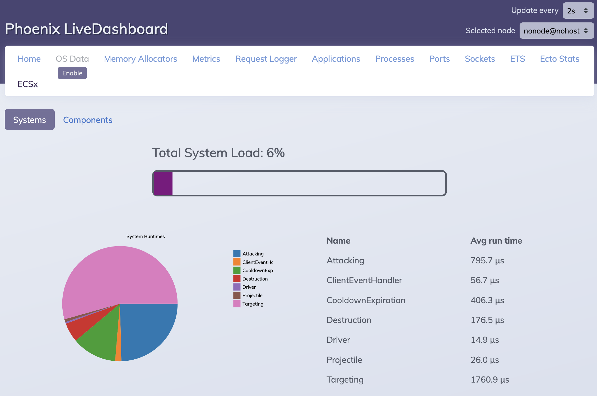

# ECSx.LiveDashboard

[](https://hex.pm/packages/ecsx_live_dashboard)
[](https://github.com/APB9785/ecsx_live_dashboard/blob/master/LICENSE)



Adds an [ECSx](https://github.com/APB9785/ECSx) page to Phoenix LiveDashboard

## Features

* Monitor Systems load compared to your app's maximum capability at the current tick rate
* Compare the load of each individual System to identify where optimizations would be most beneficial
* Observe the quantity of each Component type, to ensure Components are being created and/or deleted properly
* Inspect current Component values to check data integrity

## Requirements

Your ECSx application must use Phoenix and have Phoenix LiveDashboard installed

## Installation

The package can be installed by adding `ecsx_live_dashboard` to your list of dependencies in `mix.exs`.
It is also required to use the master branch of `phoenix_live_dashboard` until they bump the version to
include the latest updates.

```elixir
def deps do
  [
    {:phoenix_live_dashboard, github: "phoenixframework/phoenix_live_dashboard"}
    {:ecsx_live_dashboard, github: "APB9785/ecsx_live_dashboard"}
  ]
end
```

Then modify the `live_dashboard` call in your `router.ex` to include ECSx LiveDashboard as an additional page:

```elixir
live_dashboard "/dashboard",
  metrics: MyAppWeb.Telemetry,
  additional_pages: [
    ecsx: ECSx.LiveDashboard.Page
  ]
```

## License

Copyright (C) 2023  Andrew P Berrien

This program is free software: you can redistribute it and/or modify it under the terms of the GNU General Public License as published by the Free Software Foundation, either version 3 of the License, or any later version.

This program is distributed in the hope that it will be useful, but WITHOUT ANY WARRANTY; without even the implied warranty of MERCHANTABILITY or FITNESS FOR A PARTICULAR PURPOSE.  See the [GNU General Public License](https://www.gnu.org/licenses/gpl.html) for more details.
